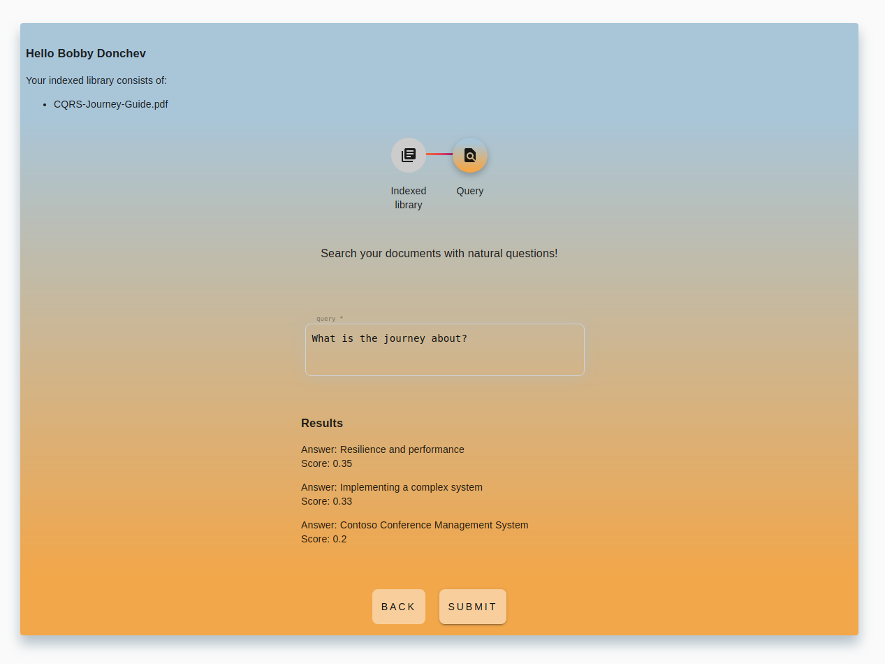

# Alexis

Alexis is an app that uses RedisAI and RediSearch to retrieve information from a corpus (indexed library) in response to a query. Essentially it's a text ranker that uses natural language processing in combination with the BM25 ranking function to both retrieve and answer questions in response to user queries.

We all are familar with keyword search, also called keyword querying, where a user types a few query terms into a search box and gets back results containing representations of the indexed sources.

Alexis extends this basic keyword search by providing a more natural way of searching indexed sources. Furthermore it aims to identify a span of text that directly answers the query, instead of returning a list of documents (or extracts of documents).

## Screenshots




## Architecture

We break the challenge of finding the correct answer to a user query into two steps:

1. First we select text that is likely to contain answers. We use RediSearch with the BM25 ranking function for this step.
2. We use a Transformer AI model that is loaded into RedisAI to identify the answer spans in the text.

By using RediSearch in the first step we drastically reduce the search space thus making the overall experience of the app faster.


We use NodeJS with typescript in the backend and React with typescript in the frontend. Besides RedisAI and RediSearch we also use RedisJSON for our user model and an asynchronous worker implemented with Redis Streams.

We expose a web server with the express framework that has the following endpoints:

```
POST /v1/users
POST /v1/login
POST /v1/logout
GET /v1/me

POST /pdf  (pdfUpload)
POST /v1/query
```

Once a user registers and logs into the app. He can start adding documents to his indexed library.
A PDF upload kicks an event to redis stream that is picked by a consumer group (1) for async processing. The consumer / worker processes the PDF, applies some cleaning and stores the PDF in a Redis hash that is indexed with RediSearch.

Afterwards the user can send natural queries to the server and is not confied to basic key word search such as "kubernetes deployments", "DDD root aggregate" etc.. but can query with more relevance such as "how do kubernetes deployments get updated?", "what is the role of a root aggregate in DDD"


# How it works?

## 1. How the data is stored

1. The user data is stored in a RedisJSON:

```
{
 firstName: string
 lastName: string
 email: string
 password: string
 pdfs: Array<{id: string, fileName: string}>
}
```

2. A RediSearch index is created for each user with:
   
```
FT.CREATE ax:idx:<userId> on HASH PREFIX 1 ax:pdfs:<userId> SCHEMA content TEXT PHONETIC dm:en
```

3. The hash that stores the pdf content is created within a consumer group that reads off an stream called **ax:stream:pdf-processing**. The payload of the stream is
   
```
{
  id: string,
  fileName: string
}
```

4. A consumer within the consumer group picks this event off the stream and processess the file and writes the content in a hash:

```
HSET ax:pdfs:<userId>.<paragraph> content <cleanedParagraphBloc> fileName <pdfFileName>
```

## 2. How the data is accessed

1. As mentioned earlier. We have an RediSearch index for each user that indexes this hash and provides lookup capabilities to find relevant content given a user query. We look up content with:

```
FT.SEARCH ax:idx:<userId> '@content:<userQuery>' SCORER BM25 WITHSCORES LIMIT 0 4
```

2. The returned content from RediSearch we feed into the AI model that is being surfed with RedisAI!


## How to run it locally?

You you run the app by running the following commands:


1. npm install
2. npm run bootstrap 
3. npm start


The app: http://localhost:3000

Redis Insight: http://localhost:8001

### Test

```
npm test
```

